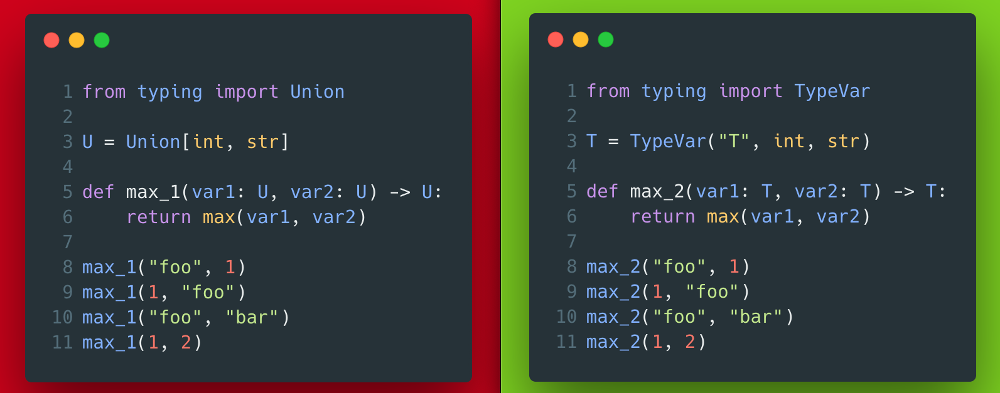

# 1 - Union vs TypeVar

On the left, the imaginary example program would crash on the lines 8 and 9.
Mypy could not help with it.
On the right, mypy would complain about the lines 8 and 9, which is probably what we want.
So, TypeVar is a better choice if the type must be consistent across multiple uses within a given scope.




??? info "Read more"
    * TypeVar official docs: [https://docs.python.org/3/library/typing.html#typing.TypeVar](https://docs.python.org/3/library/typing.html#typing.TypeVar)

??? tip "The code"
    Left:
    ```python
    --8<-- "code/1/left.py"
    ```
    Right:
    ```python
    --8<-- "code/1/right.py"
    ```
