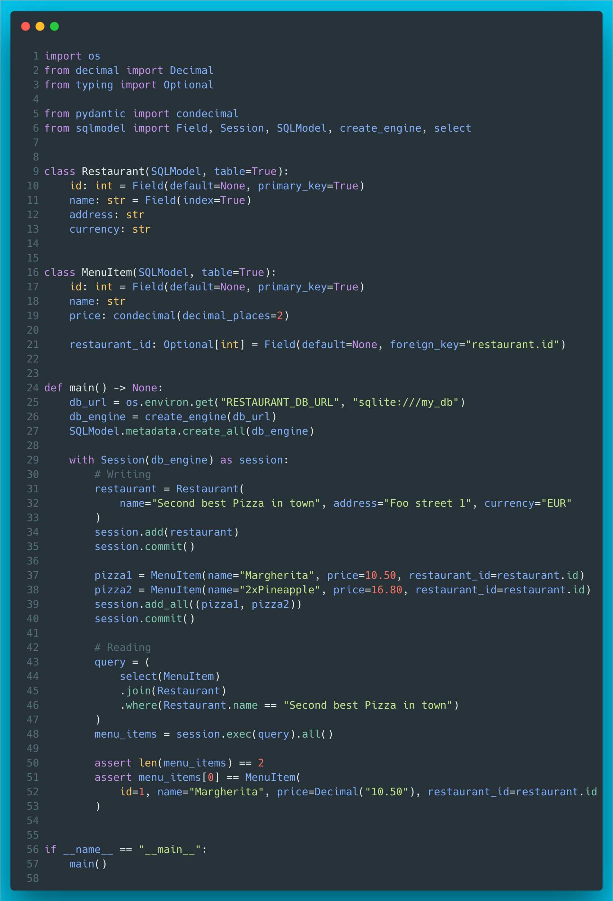
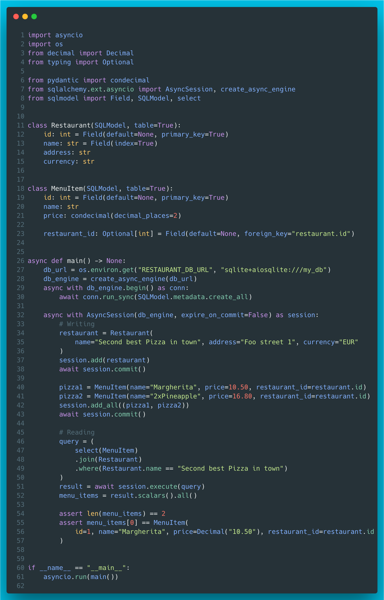

# 10 - SQLModel

SQLModel is a relatively new ORM library from Sebastián Ramírez who is also the author of FastAPI. SQLModel is basically a thin layer on top of SQLAlchemy which makes it possible to define SQL database tables as pydantic models which are also SQLAlchemy models under the hood.



And here's an async version of the exactly same example.


??? info "Read more"
    * Docs: [https://sqlmodel.tiangolo.com/](https://sqlmodel.tiangolo.com/)
    * GitHub repo: [https://github.com/tiangolo/sqlmodel](https://github.com/tiangolo/sqlmodel)
    * SQLModel discussed in Talk Python podcast: [SQLModel: The New ORM for FastAPI and Beyond](https://talkpython.fm/episodes/show/353/sqlmodel-the-new-orm-for-fastapi-and-beyond)

??? tip "The code"
    Synchronous version
    ```python
    --8<-- "code/10/sync.py"
    ```

    Asynchronous version
    ```python
    --8<-- "code/10/async.py"
    ```

    tested with:
    ```
    --8<-- "code/10/requirements.txt"
    ```
    