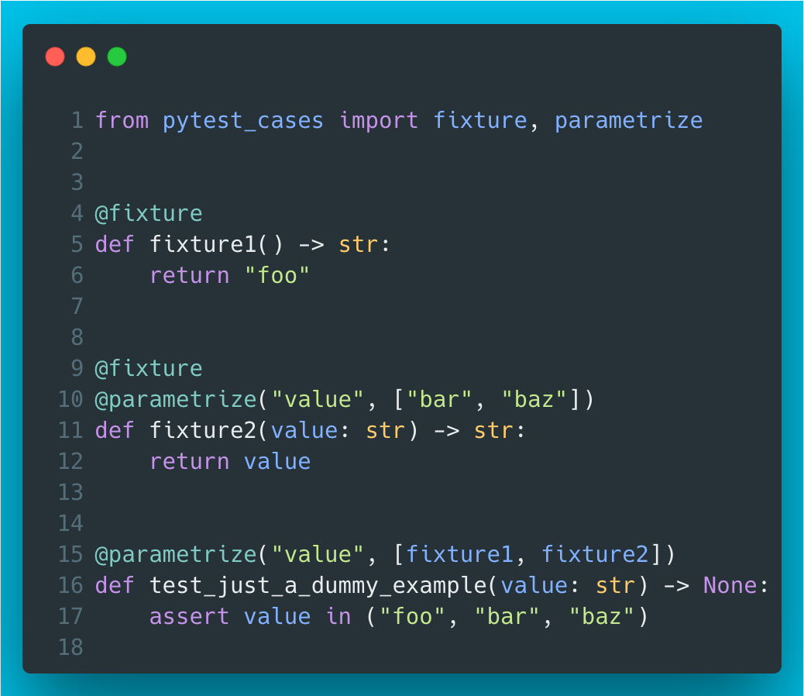

# 11 - pytest-cases

The core idea behind pytest-cases is to separate test code from test cases. One of its cool features is the possibility to use fixtures inside parametrize. Additionally, it enables familiar syntax for parametrizing fixtures. 



The output looks like this:


??? info "Read more"
    * pytest-cases docs: [https://smarie.github.io/python-pytest-cases/](https://smarie.github.io/python-pytest-cases/)
    * pytest-cases GitHub repo: [https://github.com/smarie/python-pytest-cases/](https://github.com/smarie/python-pytest-cases/)

??? tip "The code"
    ```python
    --8<-- "code/11/pytest_test_cases_example.py"
    ```