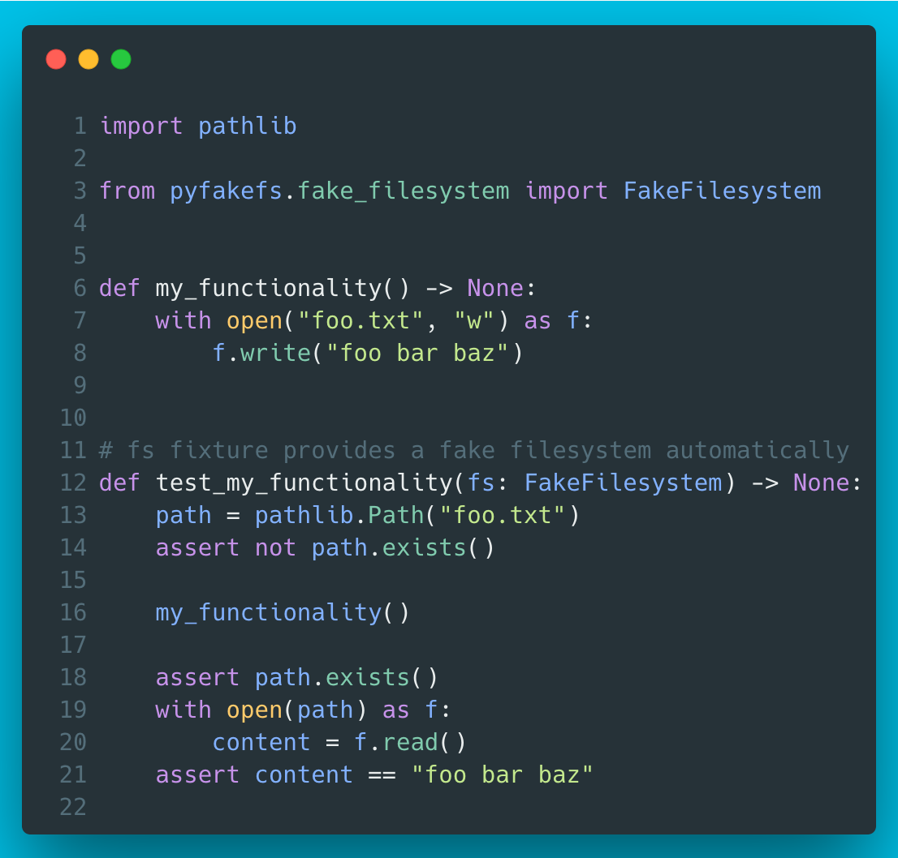

# 12 - pyfakefs

`pyfakefs` implements a fake filesystem which mocks the Python file system modules. Super handy for mocking file I/O in tests and comes with a built-in pytest plugin.



??? info "Read more"
    * pyfakefs GitHub: [https://github.com/jmcgeheeiv/pyfakefs/](https://github.com/jmcgeheeiv/pyfakefs/)
    * pyfakefs docs: [http://jmcgeheeiv.github.io/pyfakefs/release/index.html](http://jmcgeheeiv.github.io/pyfakefs/release/index.html)

??? tip "The code"
    ```python
    --8<-- "code/12/pyfakefs_example.py"
    ```