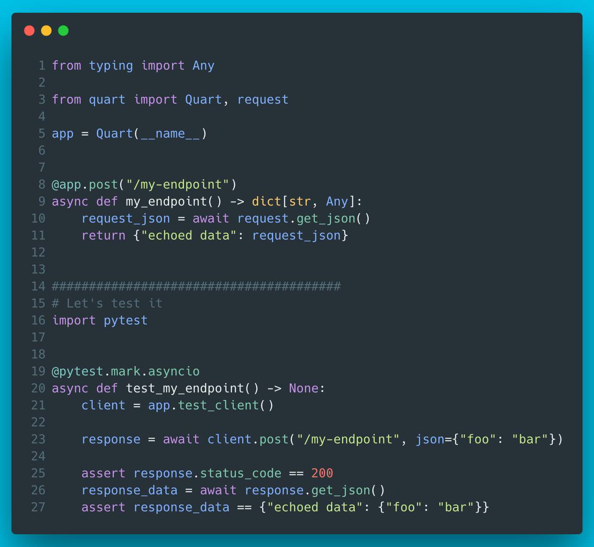

# 13 - Quart
Quart is an ASGI re-implementation of the Flask API with some added ASGI specific features, such as websockets.
If you have a Flask project and would like to go truly async, migrating to Quart is an option.
Quart recently became a Pallets project (the folks behind Flask, Click, Jinja, etc) and they apparently intend to merge Quart and Flask to eventually have ASGI support in Flask.




??? info "Read more"
    * Docs: [https://quart.palletsprojects.com/en/latest/index.html](https://quart.palletsprojects.com/en/latest/index.html)
    * GitHub repo: [https://github.com/pallets/quart](https://github.com/pallets/quart)
    * Quart became part of Pallets: [https://palletsprojects.com/blog/quart-pallets/](https://palletsprojects.com/blog/quart-pallets/) 

??? tip "The code"
    ```python
    --8<-- "code/13/quart_example.py"
    ```

    tested with:
    ```
    --8<-- "code/13/requirements.txt"
    ```

    Run the server:
    ```
    QUART_APP=quart_example:app quart run
    ```

    Or just the test case:
    ```
    pytest quart_example.py
    ```