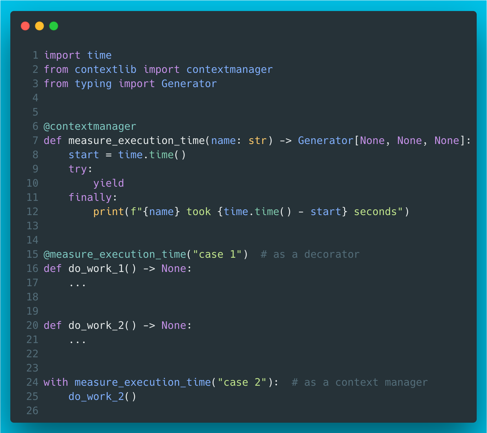

# 2 - contextmanager from contextlib

Did you know that you can also use a context manager as a decorator?



??? info "Read more"
    * Official docs: [https://docs.python.org/3/library/contextlib.html#contextlib.contextmanager](https://docs.python.org/3/library/contextlib.html#contextlib.contextmanager)

??? tip "The code"
    ```python
    --8<-- "code/2/ep2.py"
    ```