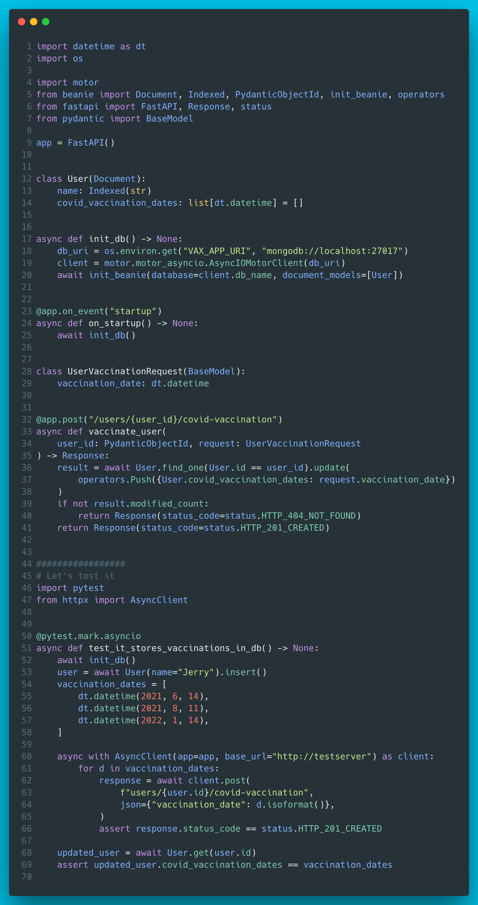

# 3 - Modern Python web stack

Showcasing what modern Python looks like via simple web app which stores covid vaccination history.

FastAPI as the web framework, pydantic for runtime type-safe model definitions, Beanie for async mongo ODM & pytest + httpx for testing.



??? info "Read more"
    * FastAPI: [https://fastapi.tiangolo.com/](https://fastapi.tiangolo.com/)
    * pydantic: [https://pydantic-docs.helpmanual.io/](https://pydantic-docs.helpmanual.io/)
    * Beanie: [https://roman-right.github.io/beanie/](https://roman-right.github.io/beanie/)
    * pytest: [https://docs.pytest.org/en/latest/](https://docs.pytest.org/en/latest/)
    * HTTPX: [https://www.python-httpx.org/](https://www.python-httpx.org/)

??? tip "The code"
    ```python
    --8<-- "code/3/vax_app.py"
    ```
    
    tested with:
    ```
    --8<-- "code/3/requirements.txt"
    ```

    Run the server:
    ```
    uvicorn vax_app:app
    ```

    Or just the test case:
    ```
    pytest vax_app.py
    ```
    