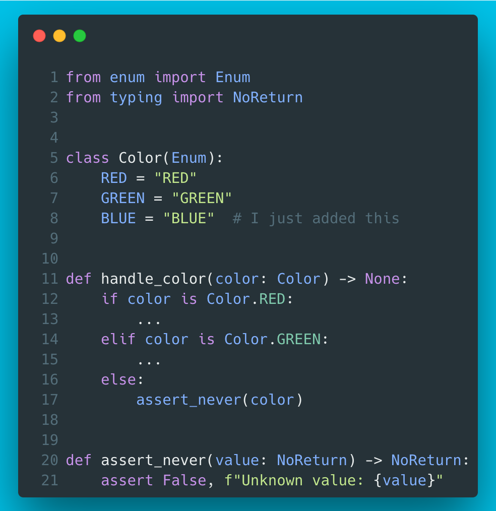

# 4 - Exhaustiveness checking with mypy

This technique is handy if there’s logic which should explicitly handle all possible values of an enumeration. With the example, mypy would kindly hint that BLUE is unhandled:

```
example.py 17: error: Argument 1 to "assert_never" has incompatible type "Literal[Color.BLUE]"; expected "NoReturn"
```

In addition to Enums, works great with e.g. Unions and Literals!



??? info "Read more"
    This is a widely known trick but I assume the original credits belong to [https://github.com/python/mypy/issues/5818](https://github.com/python/mypy/issues/5818).
    
    More on the topic in the mypy docs: [https://mypy.readthedocs.io/en/stable/literal_types.html#exhaustiveness-checks](https://mypy.readthedocs.io/en/stable/literal_types.html#exhaustiveness-checks)

??? tip "The code"
    ```python
    --8<-- "code/4/ep4.py"
    ```