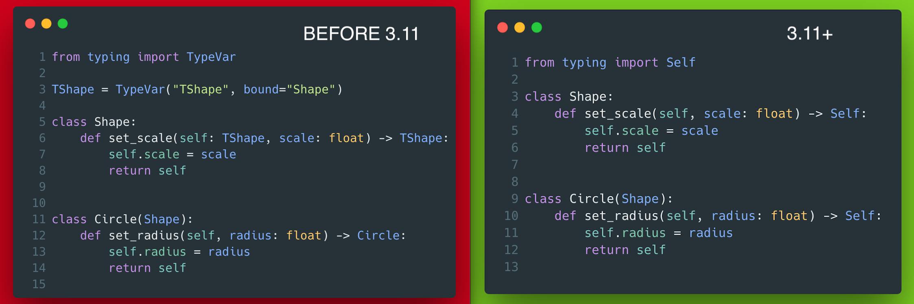

# 5 - PEP 673 Self Type

Accepted PEP, will be part of Python 3.11. The main use cases are methods which return instance(s) of their class. This will simplify especially inheritance related usages. Example from the PEP:



??? info "Read more"
    * The full PEP: [Read more: https://www.python.org/dev/peps/pep-0673/](Read more: https://www.python.org/dev/peps/pep-0673/)

??? tip "The code"
    Left:
    ```python
    --8<-- "code/5/left.py"
    ```

    Right:
    ```python
    --8<-- "code/5/right.py"
    ```