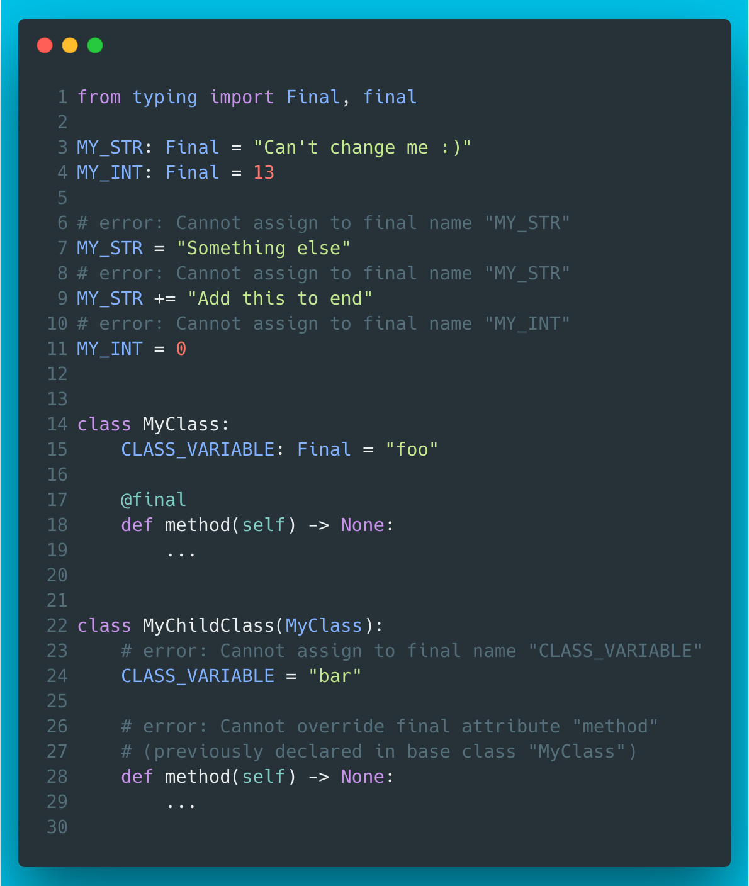

# 6 - Final qualifier

The Final type annotation helps in documenting constants in a type checker (e.g. mypy) friendly way. The final decorator can be used to restrict the use of inheritance (also for whole classes) and method overrides.

Similar features are available in many other programming languages but I feel that these are not widely known among Python peeps. Available in Python 3.8+.



??? info "Read more"
    * `typing.Final`: [https://docs.python.org/3/library/typing.html#typing.Final](https://docs.python.org/3/library/typing.html#typing.Final)
    * `@typing.final`: [https://docs.python.org/3/library/typing.html#typing.final](https://docs.python.org/3/library/typing.html#typing.final)

??? tip "The code"
    ```python
    --8<-- "code/6/ep6.py"
    ```