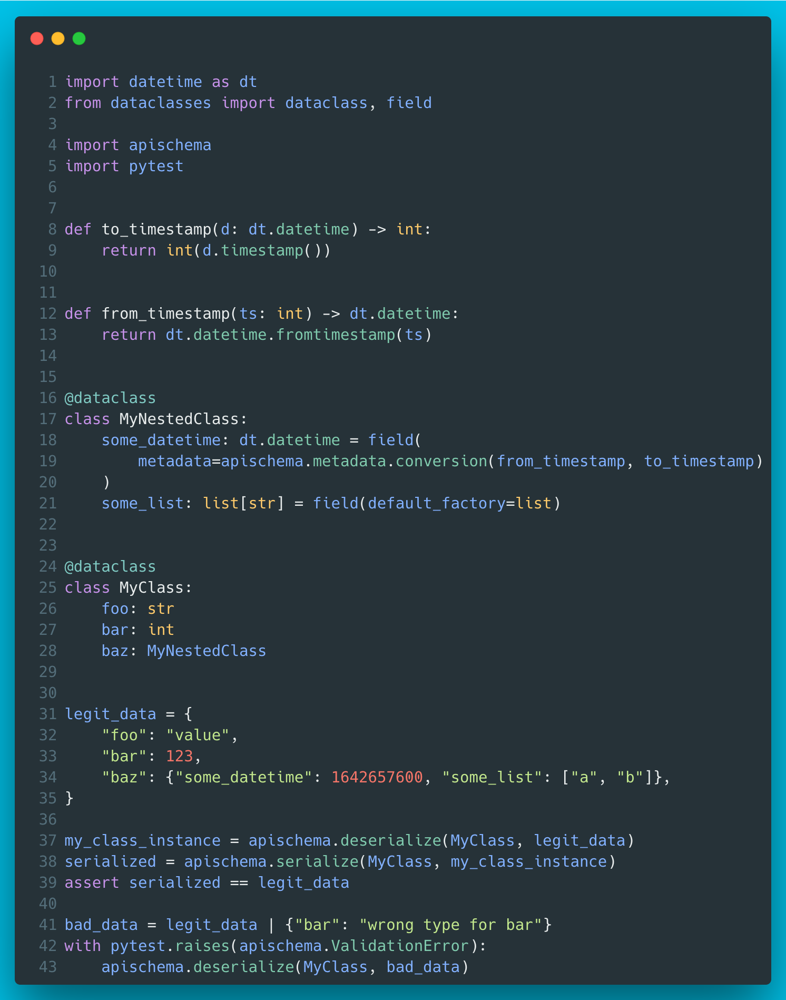

# 7 - apischema

A relatively recent competitor for pydantic. The core features include JSON (de)serialization with GraphQL and JSON schema generation. And all this via native dataclasses!



??? info "Read more"
    * apischema GitHub repo: [https://github.com/wyfo/apischema](https://github.com/wyfo/apischema)
    * apischema Docs: [https://wyfo.github.io/apischema/](https://wyfo.github.io/apischema/)

??? tip "The code"
    ```python
    --8<-- "code/7/ep7.py"
    ```