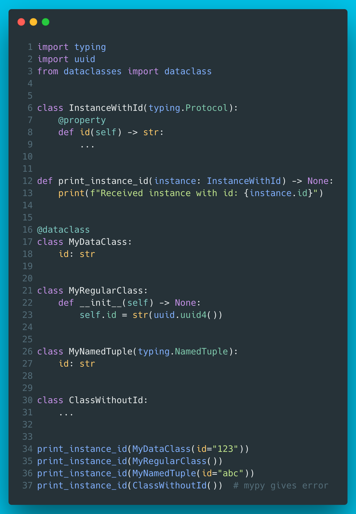

# 8 - Static duck typing via Protocol

Protocol is a good fit for use cases which only care about the behaviour and/or attributes of an object, not the actual type of the object. Protocols are great for defining interfaces, also in cases where (abstract) base classes are out of question. Available in Python 3.8+.



??? info "Read more"
    * `typing.Protocol`: [https://docs.python.org/3/library/typing.html#typing.Protocol](https://docs.python.org/3/library/typing.html#typing.Protocol)
    * Mypy docs about protocols: [https://mypy.readthedocs.io/en/stable/protocols.html](https://mypy.readthedocs.io/en/stable/protocols.html)

??? tip "The code"
    ```python
    --8<-- "code/8/ep8.py"
    ```