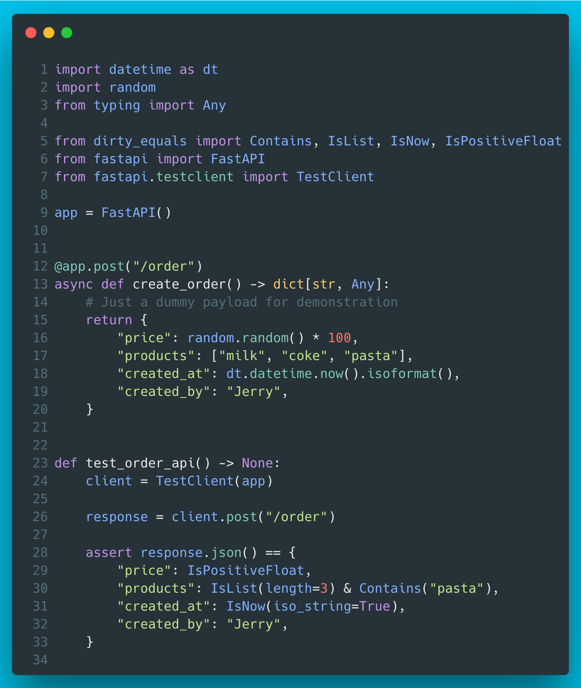

# 9 - dirty-equals
A fresh testing library from Samuel Colvin who is also the author of pydantic. `dirty-equals` makes it possible to assert full payloads without a requirement for knowing the exact values of all the keys in the payload. Handy for testing JSON APIs, for example.




??? info "Read more"
    * GitHub repo: [https://github.com/samuelcolvin/dirty-equals](https://github.com/samuelcolvin/dirty-equals)
    * Docs: [https://dirty-equals.helpmanual.io/](https://dirty-equals.helpmanual.io/)

??? tip "The code"

    ```python
    --8<-- "code/9/ep9.py"
    ```

    tested with:
    ```
    --8<-- "code/9/requirements.txt"
    ```