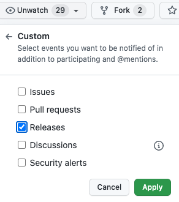

# Daily dose of Python

Slightly more advanced Python tips and tricks in easy to digest format.

Enjoy the doses at your own pace or follow me on Twitter ([@JerryPussinen](https://twitter.com/JerryPussinen)) to receive them in realtime.
Alternatively, you can get notified about new doses by watching for releases in the [Daily dose of Python Github repo](https://github.com/jerry-git/daily-dose-of-python/):

<figure markdown>
  { width="200" }
</figure>

If you would like to suggest a daily dose topic, please [open an issue in the daily-dose-of-python GitHub repo](https://github.com/jerry-git/daily-dose-of-python/issues/new?title=Topic%20suggestion:&body=I%20would%20like%20to%20see%20a%20daily%20dose%20of%20this%20topic%20because%20...&labels=topic+suggestion&assignees=jerry-git).
## The author

<figure markdown>
  { width="200" }
</figure>

Hi, I'm Jerry 👋

I work as a Python Competence Lead at [Wolt](https://wolt.com/). I'm mainly using Python for web development but the content of the _Daily dose of Python_ has more general focus.  

I've been actively following the vibrant Python ecosystem for several years. The language has evolved quite a bit during the recent years.
The goal of the _Daily dose of Python_ is to showcase what _modern_ Python looks and feels like.
